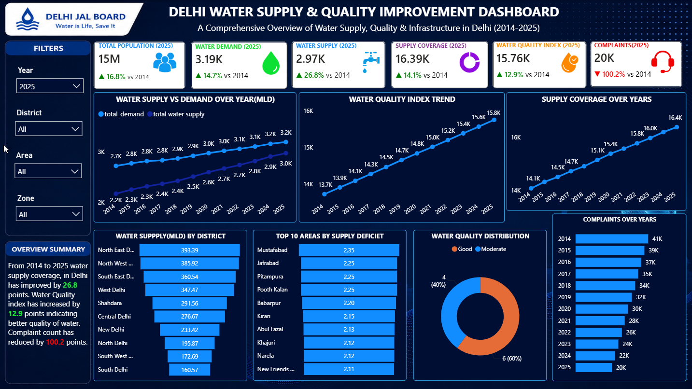

# 🚰 Delhi Water Supply & Quality Improvement Dashboard

## 📌 Project Overview

This Power BI dashboard provides a comprehensive analysis of Delhi's water supply, demand, infrastructure, water quality, and consumer complaints from **2014 to 2025**.

The project demonstrates data visualization, business intelligence, KPI reporting, and interactive dashboard development using Microsoft Power BI.

---

## 📊 Dashboard Preview

---

# 🎯 Objectives

- Analyze annual water demand and supply.
- Monitor water quality improvements.
- Evaluate supply coverage across Delhi.
- Identify districts with higher water supply.
- Detect areas with supply deficits.
- Track complaint trends over time.
- Build an interactive dashboard for decision-making.

---

# 📈 Key KPIs

- Total Population
- Water Demand (MLD)
- Water Supply (MLD)
- Supply Coverage
- Water Quality Index
- Total Complaints

---

# 📌 Dashboard Features

### Executive KPIs

- Population
- Water Demand
- Water Supply
- Water Quality
- Complaint Count

### Trend Analysis

- Water Supply vs Demand
- Water Quality Trend
- Supply Coverage Growth
- Complaint Trend

### District Analysis

- Water Supply by District
- Top 10 Areas with Supply Deficit

### Water Quality Analysis

- Quality Distribution

### Interactive Filters

- Year
- District
- Area
- Zone

---

# 🛠 Tools Used

- Microsoft Power BI
- Power Query
- DAX
- Data Modeling
- Interactive Visualizations

---

# 📊 Business Insights

- Water supply has steadily increased between 2014 and 2025.
- Water quality has consistently improved over the years.
- Supply coverage has expanded across Delhi.
- Consumer complaints have significantly decreased.
- Several areas continue to experience supply deficits requiring infrastructure improvements.

---

# 📂 Dataset

The dataset used in this project is **synthetic** and created solely for learning, portfolio development, and demonstration purposes.

It does not represent official Delhi Jal Board records.

---

# 🚀 Skills Demonstrated

- Dashboard Design
- Data Cleaning
- Power Query
- DAX Measures
- KPI Reporting
- Trend Analysis
- Business Intelligence
- Data Storytelling

---

# ⭐ Future Improvements

- Real-time API integration
- Predictive water demand forecasting
- GIS-based district maps
- Mobile-optimized dashboard
- Automated report refresh

---

# 👨‍💻 Author

**Aryan Shahi**

Aspiring Data Analyst

- SQL
- Power BI
- Python
- Machine Learning

If you found this project useful, consider giving it a ⭐.